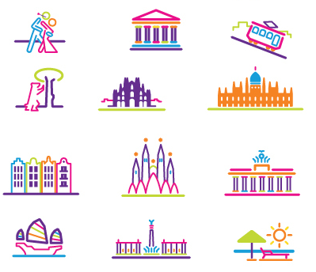

# TG-12 Piktograafia kursus

### 20. november: Kasutusalad

## Branding

## Äriprotsessid

## Turism

## Piktogramm või illustratsioon?

http://visitbruges.be/

### Interiors

### Kasutajaliidesed

#### Fotorealism

### Flat

## Wayfinding

### Raamatukogud

1\. Computer science, information and general works. 2. Science and mathematics. 3. Seperate journals collection. 4. Language. 5. Law. 6. Technology & applied science. 7. Religion. 8. Arts & Recreation. 9. Philosophy & Psychology. 10. Social Sciences. 11. Literature.

### Muuseumid

#### Kino

#### Hotellid

### Poed

### Branding

### Parklad

## 12. november: Ilma-piktogrammid
  
  * Eesti ajalehed
  * Eesti ajalehed veebis
  * Eesti portaalid
  * BBC ja CNN
  
#### Äpid

http://www.behance.net/gallery/iOS7-Weather-App/9650557 (usage)
http://www.behance.net/gallery/Authentic-Weather/7196565
http://www.behance.net/gallery/Weather-App/7438779
http://www.behance.net/gallery/Weather-app-psd/8741405
   

### 11. november: Iseseisev töö: Eesti vs Soome