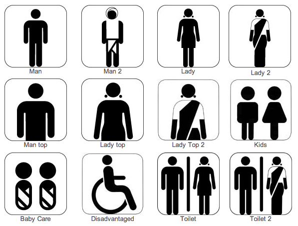
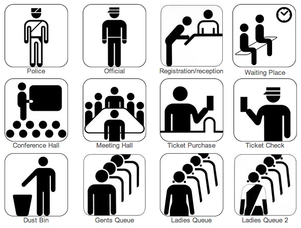
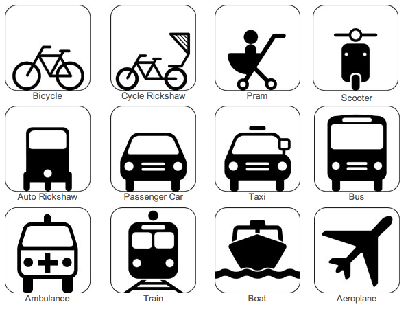
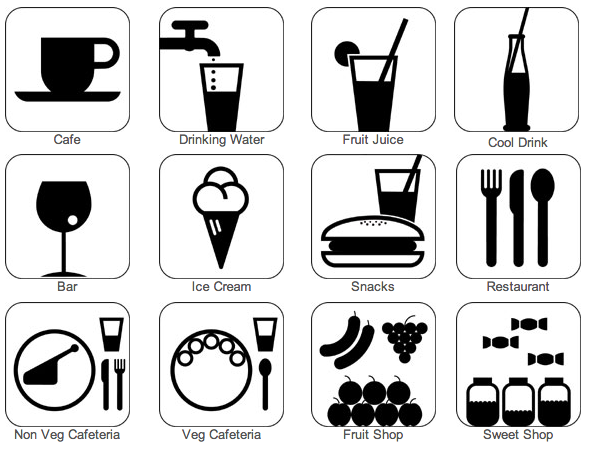
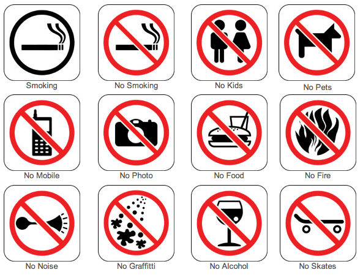
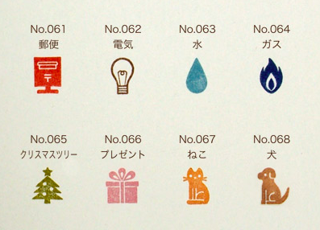
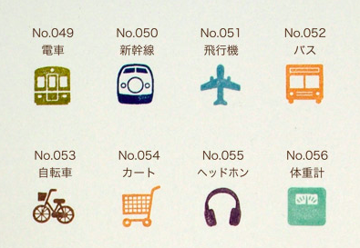
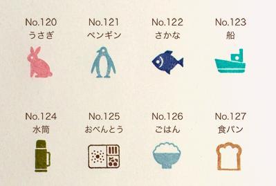

# Pictogram History

## Downloads

http://www.behance.net/gallery/Cittadino-Symbols-Free-Font/9771223

## Gern Arntz

http://www.gerdarntz.org/

http://isotyperevisited.org/

@expand
@study

## Otl Aicher

http://www.piktogramm.de/pictoserver/homepage/homepage/start/en/en_start.php

http://www.cyclinginquisition.com/2010/01/otl-aicher-and-history-behind-cyclng.html

@study

https://vimeo.com/26785804

## Icograda

http://iridescent.icograda.org/2013/03/01/icograda_and_the_development_of_pictogram_standards_1963-1986/2013.php

http://iridescent.icograda.org/database/rte/files/Iridescent_Vol2Issue2_Bakker.pdf

@study

## General reading

https://medium.com/design-ux/bcc8e0257bc8
http://www.freshtilledsoil.com/are-hollow-icons-harder-to-understand/?ref=bloglisting&i=39
http://boxesandarrows.com/optimizing-ui-icons-for-faster-recognition/

## Responsive

http://www.responsiveicons.co.uk/

## Movies

http://design.iconfactory.com/ios-7-and-alien/

## Showing your work

### Posters

http://www.behance.net/gallery/Quon/9110969
http://www.creativereview.co.uk/cr-blog/2012/march/tim-boelaars-iconic-prints
http://designspiration.net/image/485934478323/
http://www.behance.net/gallery/BFA-Degree-Show/7331331

### Years of icons

http://sensibleworld.com/news/year-of-icons/

### Animation

http://www.theclocksmiths.it/project/nerbo/
http://www.behance.net/gallery/Pictograms/856215
http://www.behance.net/gallery/johannesburg-zoo-pictograms/3032615

@fix

https://vimeo.com/33528602

## International

## World

http://blogs.wsj.com/scene/2013/10/15/what-do-pedestrian-traffic-icons-say-about-your-culture/tab/slideshow/#slide/eos

## India

http://www.designofsignage.com/application/symbol/building/index.html

@edit

@edit

@edit

@edit

@edit

## Japan

http://www.torinoha.com/?mode=f16
http://pictopedia.jp/eng/index_country.html
http://www.spoon-tamago.com/2012/05/17/taboo-tattoo-current-state-ink-japan/#comments

## Logo

http://www.bycanyastudio.com/
@expand